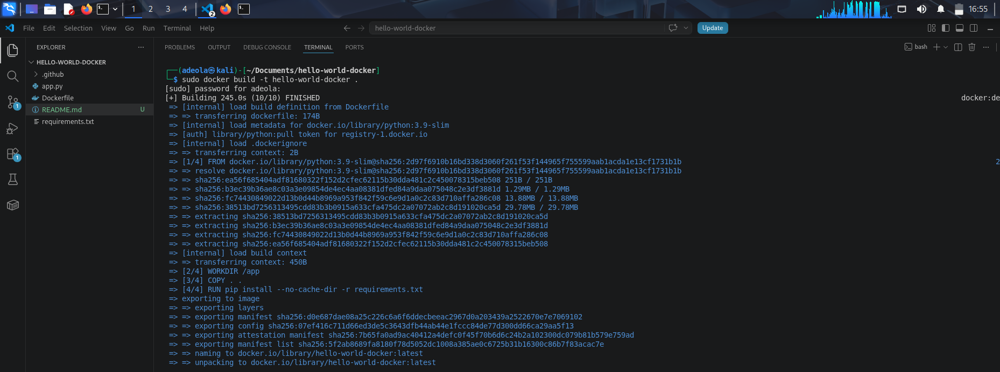
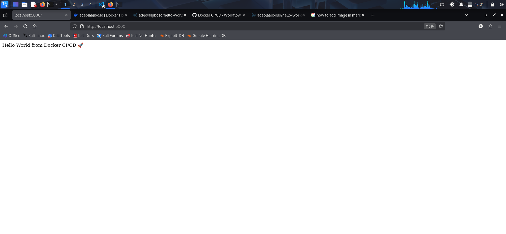
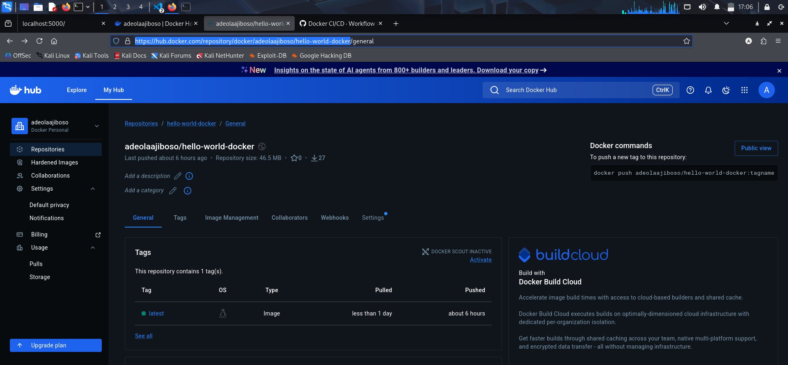
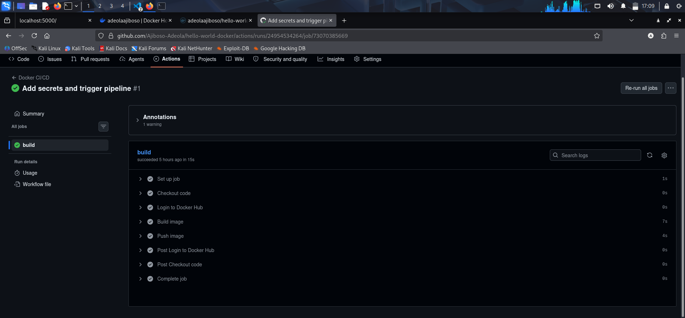

# Hello World Docker CI/CD Project

## Overview

This project demonstrates containerization of a simple Hello world application and automation using CI/CD to push Docker images to Docker Hub.

## Steps Taken
1. Application Development
- Created a simple Flask app

2. Dockerization
- Wrote a Dockerfile
- Built Docker image
- Ran container locally

3. Docker Hub Integration
- Logged into Docker Hub
- Tagged and pushed image

4. CI/CD Pipeline
- Configured GitHub Actions
- Automated build & push process

## 🐳 Docker Commands Used
### Build the Image
docker build -t hello-world-docker .

### Start an app container

docker run -d -p 127.0.0.1:5000:5000 hello-world-docker

### Push the Image

sudo docker login

sudo docker tag hello-world-docker adeolaajiboso/hello-world-docker:latest

sudo docker push adeolaajiboso/hello-world-docker:latest

## Docker Hub Repo

[Docker Hub Link](https://hub.docker.com/repository/docker/adeolaajiboso/hello-world-docker/general)

## ScreenShot
- **Docker Build Succes**

- **Running app in browser**

- **Docker Hub image**

- **GitHub Actions Workflow**

